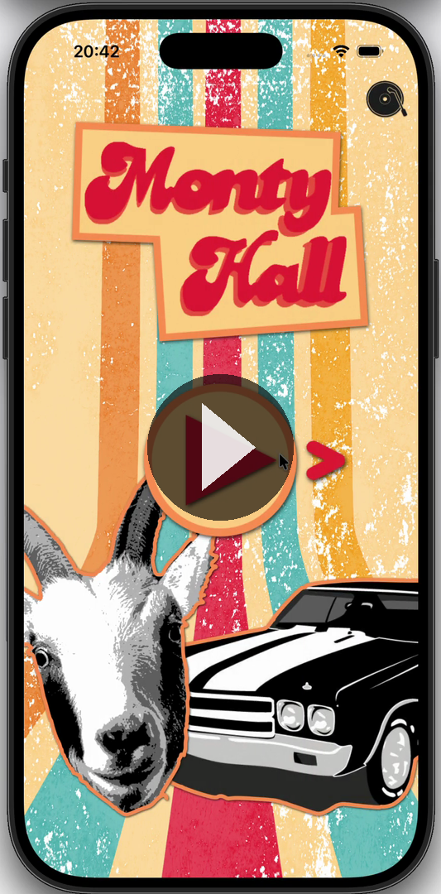
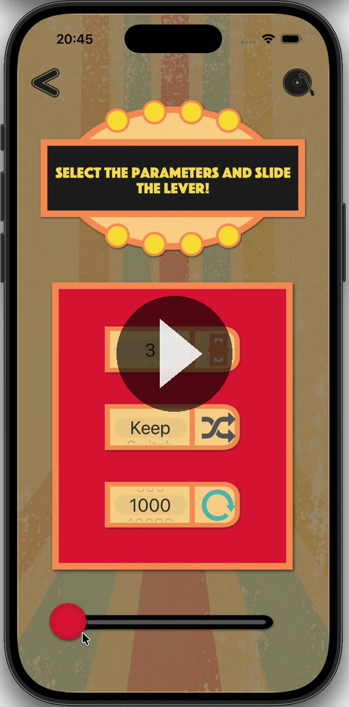

# Monty Hall Problem

## Welcome to the 70s! 🕺

That is a charmful decade with many colors patterns, disco music, and other cultural expressions that we refer to as vintage.

In this era, game shows were on their peaks. One of the most famous was Let's Make a Deal, presented by the emblematic Monty Hall. 

On this show, there was a game with three doors. Two had goats behind them, and only one had a car. The contestant had to choose a door. Then Monty opened another, showing a Goat. Finally, the player had to decide to keep the first choice or switch to the other closed door.

### What would you do?

This problem became a legend in mathematics, becoming a reason for countless discussions and probably some broken friendships. But now, you will understand for once and for all what to do.

## The Challenge

This app was built for a 2021 Apple Developer Academy challenge, presented to Apple engineers. The brief was to build a solo app around a theme I found intriguing. The Monty Hall problem was an easy pick, since it's famous and counter-intuitive, which made it a great chance to demonstrate. The feedback from Apple was strong, with the app scoring among the highest in the cohort for concept and execution.

Here's the game in action (click to download):

  

## Technicalities:

### Extrapolation:

Despite the game show only having 3 doors, this problem has a higher potential. So I developed a generic model that constructs a Monty Hall Problem with any given number of doors. Greater the number, clearly the logical answer gets. It also tracks your history and can simulate a custom number of games.

Below is the simulation mode, extrapolating the problem to *n* cases (click to download):

  

